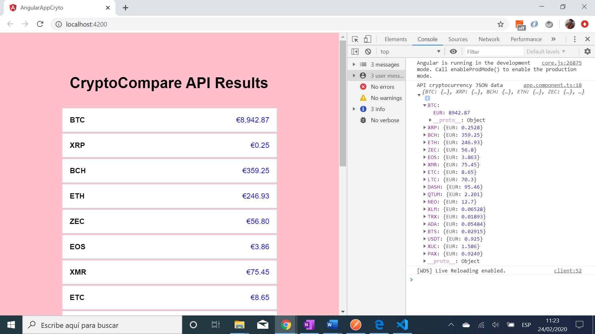

# :zap: Angular App Crypto

* App to get crypto currency price data from a [CryptoCompare](https://min-api.cryptocompare.com/) API.

**\* Note: to open web links in a new window use: _ctrl+click on link_**

## :page_facing_up: Table of contents

* [:zap: Angular App Crypto](#zap-angular-app-crypto)
  * [:page_facing_up: Table of contents](#page_facing_up-table-of-contents)
  * [:books: General info](#books-general-info)
  * [:camera: Screenshots](#camera-screenshots)
  * [:signal_strength: Technologies](#signal_strength-technologies)
  * [:floppy_disk: Setup](#floppy_disk-setup)
  * [:computer: Code Examples](#computer-code-examples)
  * [:cool: Features](#cool-features)
  * [:clipboard: Status & To-Do List](#clipboard-status--to-do-list)
  * [:clap: Inspiration](#clap-inspiration)
  * [:envelope: Contact](#envelope-contact)

## :books: General info

* Angular httpClient used to get API data
* Data displayed using one-way data-binding and an \*ngFor loop
* Separate `data.service.ts` file used to get API price data. This data is subscribed to in `app.component.ts`

## :camera: Screenshots

.

## :signal_strength: Technologies

* [Angular v10](https://angular.io/)
* [RxJS Library v6](https://angular.io/guide/rx-library) used to [subscribe](http://reactivex.io/documentation/operators/subscribe.html) to the [observable](http://reactivex.io/documentation/observable.html)

## :floppy_disk: Setup

* Install dependencies using `npm i`.
* Run `ng serve` for a dev server. Navigate to `http://localhost:4200/`. The app will automatically reload if you change any of the source files.

## :computer: Code Examples

* `data.service.ts` using httpClient service with a `getPrices()` function to get crypto currency details from the API.

```typescript
@Injectable()
export class DataService {
  result: any;
  currencyCode: string;
  display: string;

  constructor(private http: HttpClient) {}

  // function to get crypto prices in euro from the API - no API key required.
  getPrices() {
    const fsymsList =
      "BTC,XRP,BCH,ETH,ZEC,EOS,XMR,ETC,LTC,DASH,QTUM,NEO,XLM,TRX,ADA,BTS,USDT,XUC,PAX,IOT";
    return this.http
      .get(
        "https://min-api.cryptocompare.com/data/pricemulti?fsyms=" +
          fsymsList +
          "&tsyms=EUR"
      )
      .pipe(map((result) => (this.result = result)));
  }
}
```

## :cool: Features

* Angular httpClient used to get data from an external API.
* [Angular currency pipe](https://angular.io/api/common/CurrencyPipe) & [rxjs map operator](https://angular.io/guide/rx-library) used to extract currency data and display it to the correct format.
* Updated to the latest version of Angular 10.
* Dependencies updated with 0 dependency vulnerabilities.

## :clipboard: Status & To-Do List

* Status: Working & Deployed to Github.
* To-Do: add mat-cards and colours to improve UI.

## :clap: Inspiration

* [Angular CryptoCurrency Tutorial - Display Exchange Data with an API](https://www.youtube.com/watch?v=U3INaC0leXg&t=589s)

## :envelope: Contact

* Repo created by [ABateman](https://www.andrewbateman.org) - you are welcome to [send me a message](https://andrewbateman.org/contact)
