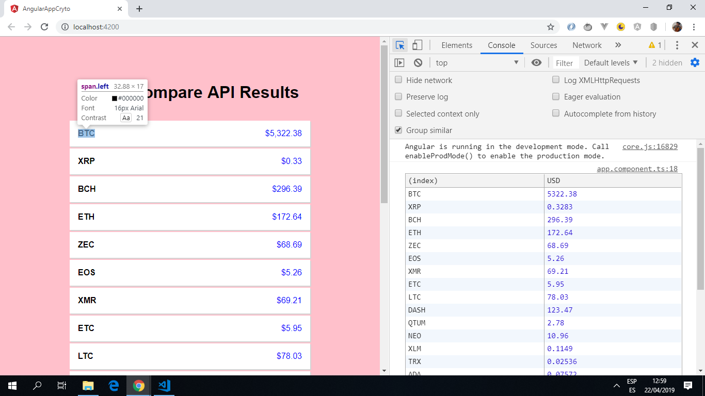

# Angular App Crypto

* App to get crypto currency price data from a [CryptoCompare](https://min-api.cryptocompare.com/) API.

*** Note: to open web links in a new window use: _ctrl+click on link_**

## Table of contents

* [General info](#general-info)
* [Screenshots](#screenshots)
* [Technologies](#technologies)
* [Setup](#setup)
* [Features](#features)
* [Status](#status)
* [Inspiration](#inspiration)
* [Contact](#contact)

## General info

* Angular httpClient used to get API data.

* Data displayed using one-way data-binding and an *ngFor loop.

* separate data.service.ts file used to get API price data. This data is subscribed to in app.component.ts

## Screenshots

.

## Technologies

* [Angular v7.2.13](https://angular.io/) & [Angular CLI v7.3.8](https://cli.angular.io/).

* [RxJS Library v6.4.0](https://angular.io/guide/rx-library) used to [subscribe](http://reactivex.io/documentation/operators/subscribe.html) to the API data [observable](http://reactivex.io/documentation/observable.html).

## Setup

Run `ng serve` for a dev server. Navigate to `http://localhost:4200/`. The app will automatically reload if you change any of the source files.

## Code Examples

* `data.service.ts` using httpClient service with a `getPrices()` function to get crypto currency details from the API.

```typescript

@Injectable()
export class DataService {
  result:       any;
  currencyCode: string;
  display:      string;

  constructor(private http: HttpClient) {}

  // function to get crypto prices from the API - no API key required.
  getPrices() {
    const fsymsList = 'BTC,XRP,BCH,ETH,ZEC,EOS,XMR,ETC,LTC,DASH,QTUM,NEO,XLM,TRX,ADA,BTS,USDT,XUC,PAX,IOT';
    return this.http
      .get('https://min-api.cryptocompare.com/data/pricemulti?fsyms=' + fsymsList + '&tsyms=USD')
      .pipe(map(
        result => this.result = result
      ));
  }
}

```

## Features

* Angular httpClient used to get data from an external API.

* [Angular currency pipe](https://angular.io/api/common/CurrencyPipe) & [rxjs map operator](https://angular.io/guide/rx-library) used to extract currency data and display it to the correct format.

* updated to the latest version of Angular 7. Dependencies updated with 0 dependency vulnerabilities.

## Status & To-Do List

* Status: Simple working app that extracts API cryptocurrency data and displays it.

* To-Do: add mat-cards and colours to improve UI.

## Inspiration

* [Angular CryptoCurrency Tutorial - Display Exchange Data with an API](https://www.youtube.com/watch?v=U3INaC0leXg&t=589s)

## Contact

Created by [ABateman](https://www.andrewbateman.org) - feel free to contact me!
